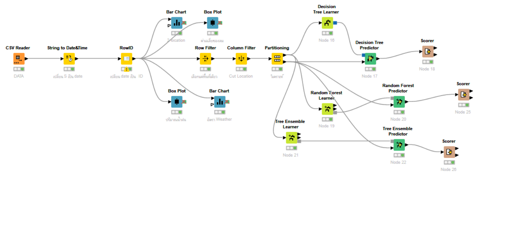
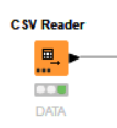
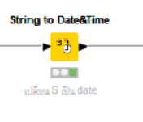
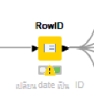
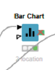
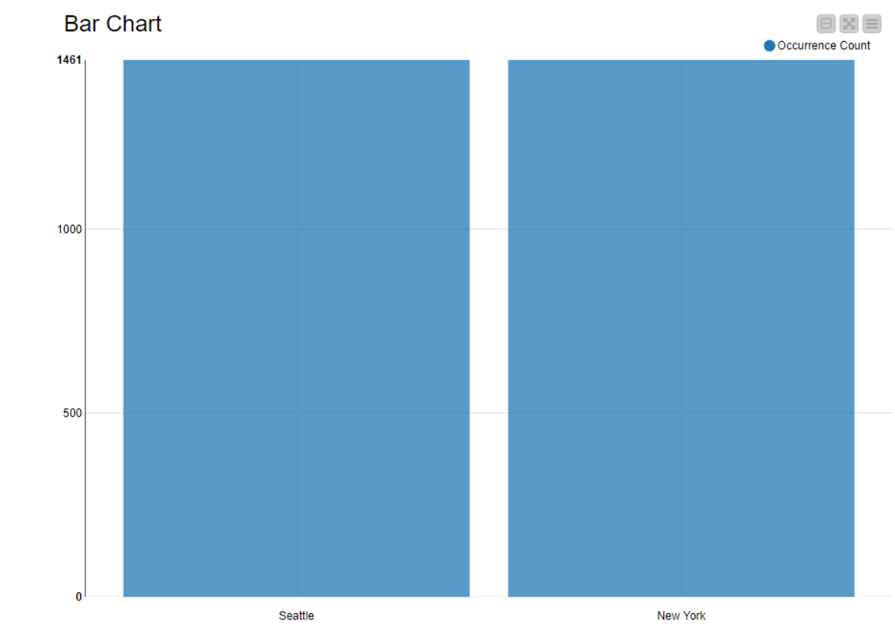
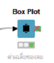
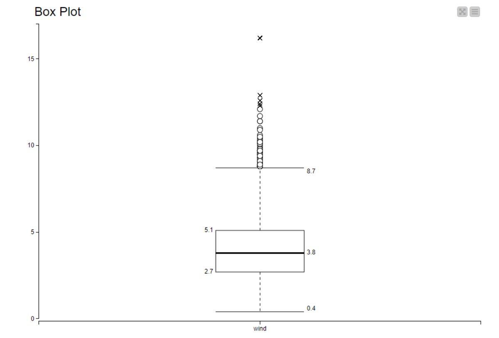
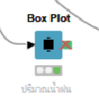
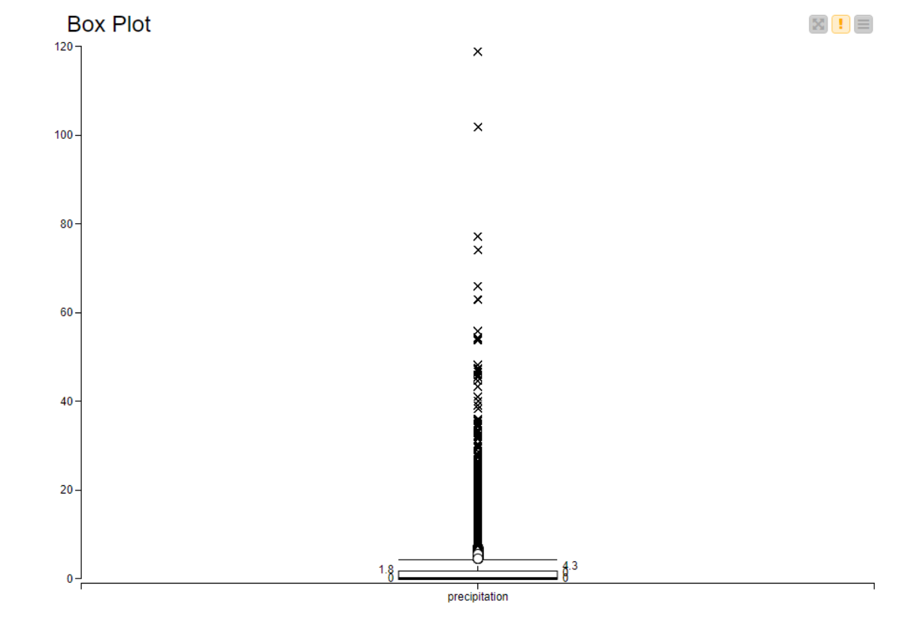

# Codeless-AI-ML-2022-Project

## Overview
The project is about weather prediction by using KNIME. We use a dataset for weather prediction which is authored by Jeffrey Heer on Github.

https://github.com/vega/vega/blob/main/docs/data/weather.csv?fbclid=IwAR3jcck1UiTNRfemAhCxDVhrsgub4HmvKmCvGehhFjpr9rG1ug8CRQ9IiMo

The main objective of this project is to find out which model was the most accurate. 

## Tools
- KNIME

##Columns
- Location
- Date
- Precipitation
- Temp_max
- Temp_min
- Wind
- Weather

## Methods
Our dataset is in the .CSV format, we must use the CSV reader node to access it.

for the location column it come with string type. we change it into date.

then we change date to ID.

this node will show the data of location which have 2 location is seattle and newyork.

and this node will show the average of wind. the average wind is 3.8

and this node will show the average of precipitation. which is 1.8

We specify the data to make it easier to analyze. we use row filter and column filter to select just one location (Newwork).....

